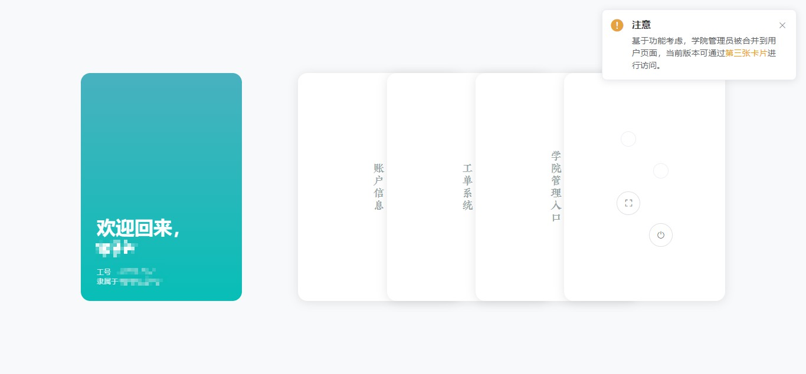
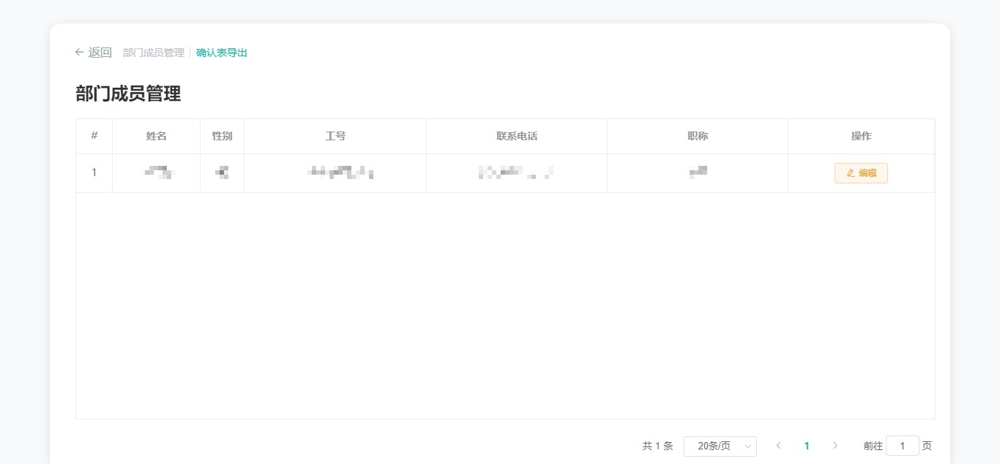
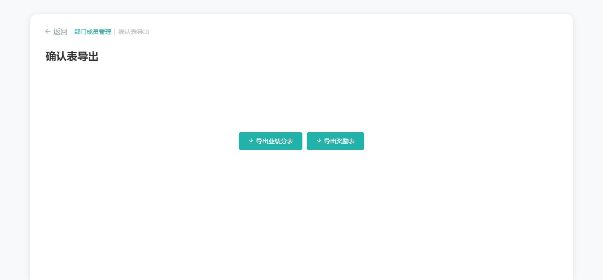

# 学院管理员

!> 请使用最新的 Chrome 浏览器访问 JUST WO 系统，以保证浏览体验。[为什么？](usage/etc?id=使用最新的浏览器访问)

## 登入

与普通用户登入不同的是，我们需要确保登入权限设置为「管理员账户」，即选中下方示意图的红色区域。

## 首页

然后进入首页，你会看见几乎和「普通用户」一模一样的界面，就像下面这样。

如果你是第一次进入，右上角会有和上图一模一样的提示。正如提示所描述的，由于现阶段学院管理员的功能不多，在设计时被整合到了用户页面的第三张卡片。

这里主要介绍的也是「学院管理入口」。

## 学院管理入口

点击「学院管理入口」卡片，我们进入学院管理功能区域。该区域有两个功能：「部门成员管理」和「确认表导出」，默认选中「部门成员管理」。

### 部门成员管理

示意图如上。功能简洁，点击 `编辑` 按钮可以对部门成员进行管理。

### 确认表导出

功能也很简洁，点一下按钮就可以了。