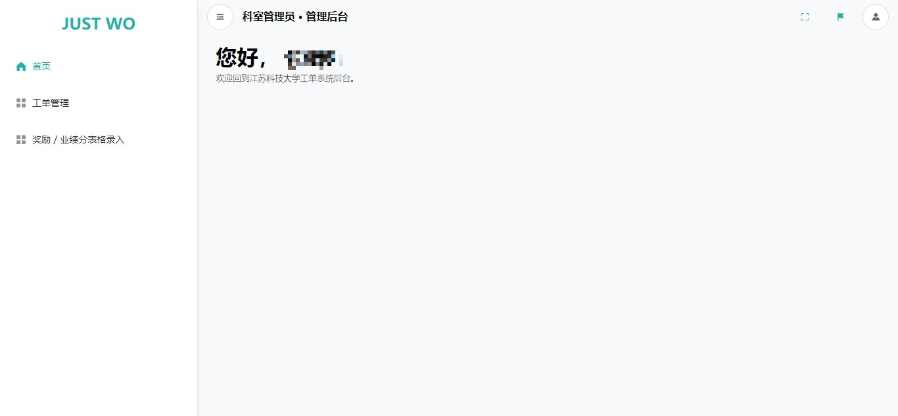
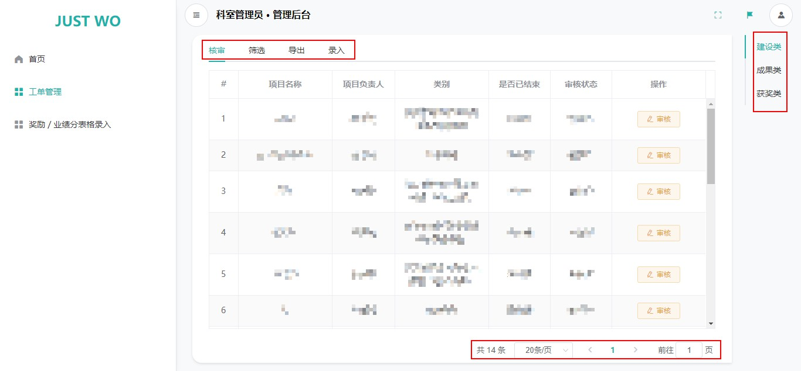
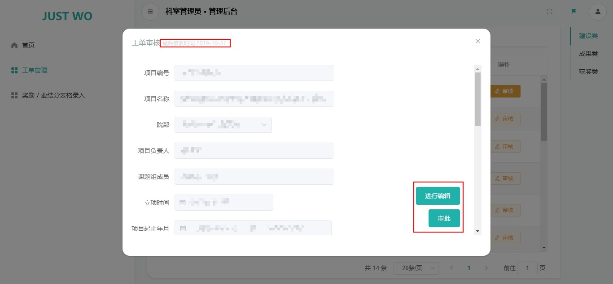
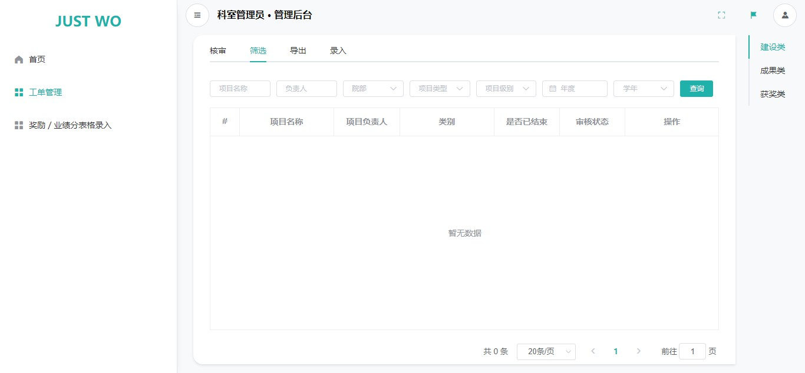
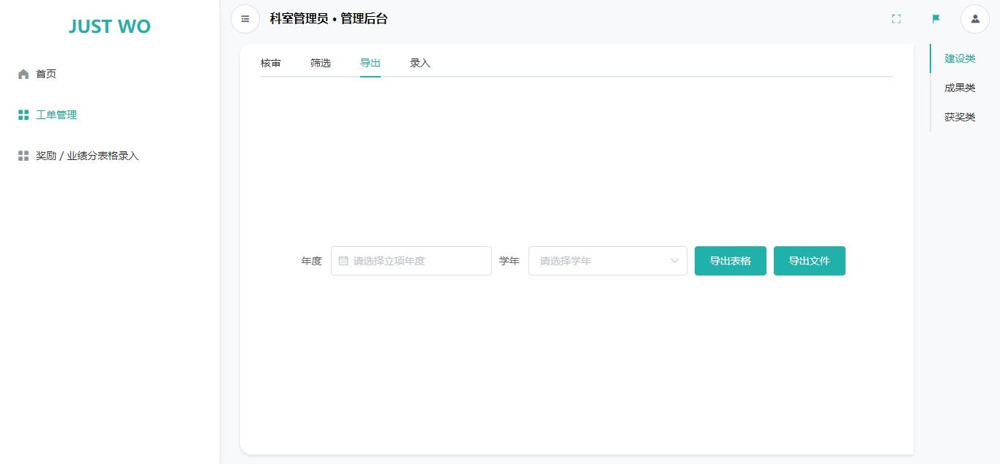
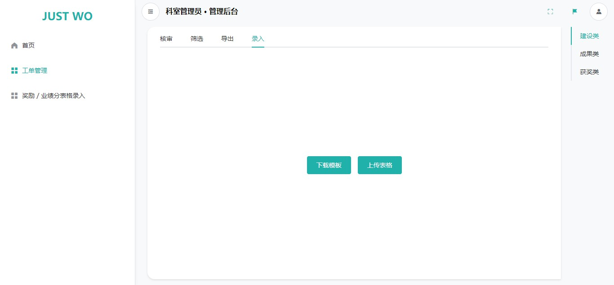
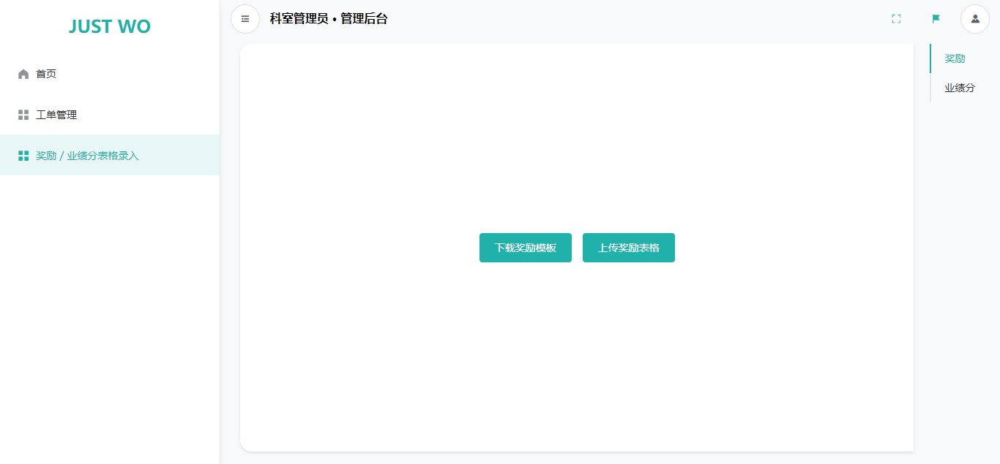

# 科室管理员

!> 请使用最新的 Chrome 浏览器访问 JUST WO 系统，以保证浏览体验。[为什么？](usage/etc?id=使用最新的浏览器访问)

## 登入

与普通用户登入不同的是，我们需要确保登入权限设置为「管理员账户」，即选中下方示意图的红色区域。

## 首页

登录后，我们进入首页。这里目前什么也没有。。。

## 工单管理

!> 「工单管理」功能选项仅当所属的部门为「质量建设与评估办公室」时才会出现。

上图显示的是工单管理页面。

请注意使用红色框出的三处标记。我们可以在右上角的标记处切换工单类别，在左上角的标记处切换对该类工单需要执行的操作。如果是在「核审」和「筛选」选项卡下，我们还可以在在右下角的标记处切换页码。

### 核审

核审的列表界面参见上一张示意图。选择一个工单，点击 `审核` 按钮，如果没有意外的话，我们会看到类似下方的界面。

上方的红色标记区域会告诉我们当前表单的最后的修改时间（或创建时间）。

点击右下角的 `进行编辑` 按钮可以对工单内容进行一些调整。而 `审批` 按钮则可以用于标记审核状态，如果标记为「不通过」，我们可能还需要填写一段文字作为原因。

### 筛选

如果想要找到特定的一个工单，那我们可能需要点击「筛选」选项卡进行筛选操作。其余功能和「核审」一样。

### 导出

导出功能需要注意的是，只填写「年度」和「学年」中的一项就可以开始下载。~~（如果都填的话会怎么样呢？反正我是不知道这两个选项的优先级。）~~

### 录入

录入，如果我们没有模板要先点击「下载模板」，按模板填写后，再上传表格。

## 奖励／业绩分表格录入

功能和操作类似上方的「录入」。

