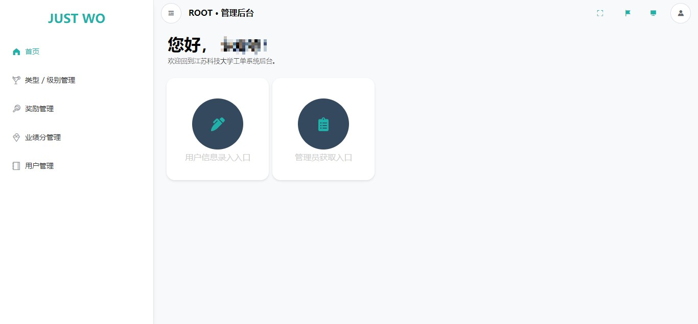
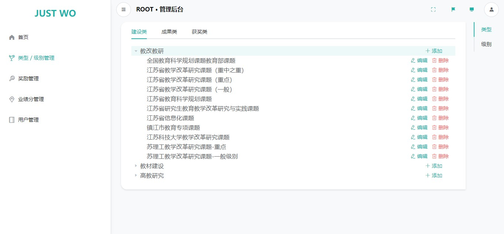
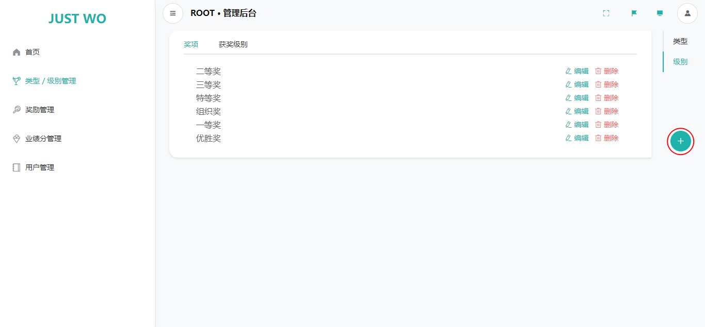
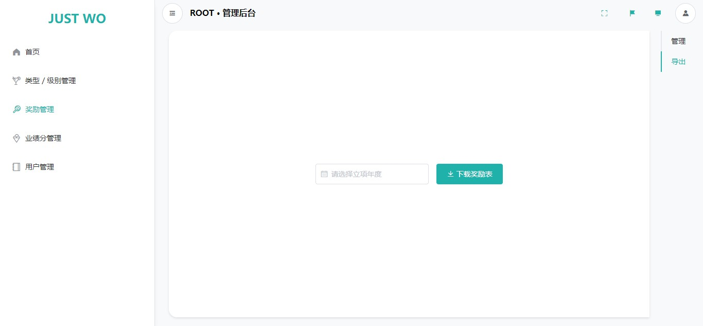

# Root 管理员

!> 请使用最新的 Chrome 浏览器访问 JUST WO 系统，以保证浏览体验。[为什么？](usage/etc?id=使用最新的浏览器访问)

## 登入

与普通用户登入不同的是，我们需要确保登入权限设置为「管理员账户」，即选中下方示意图的红色区域。

## 首页

登录后，我们进入首页。

点击「用户信息录入入口」和「管理员获取入口」上方的图标可以切换入口的状态。

## 类型／级别管理

需要注意，级别的添加在上方截图右下角的红色标记区。

## 奖励管理

注意左上角和右上角的红色标记区，我们可以在这两处切换主功能和子功能。

默认显示的是「管理」功能。

### 管理

管理分为「编辑」、「筛选」和「新增」功能。

### 导出

## 业绩分管理

与奖励管理类似。

## 用户管理

与奖励管理类似。