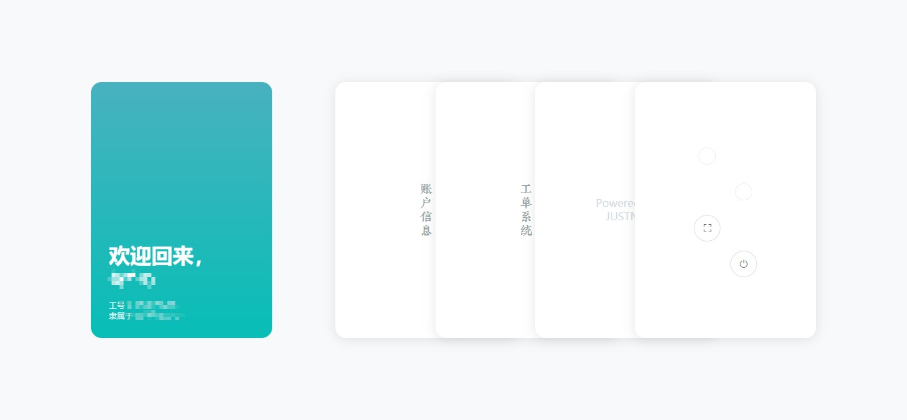
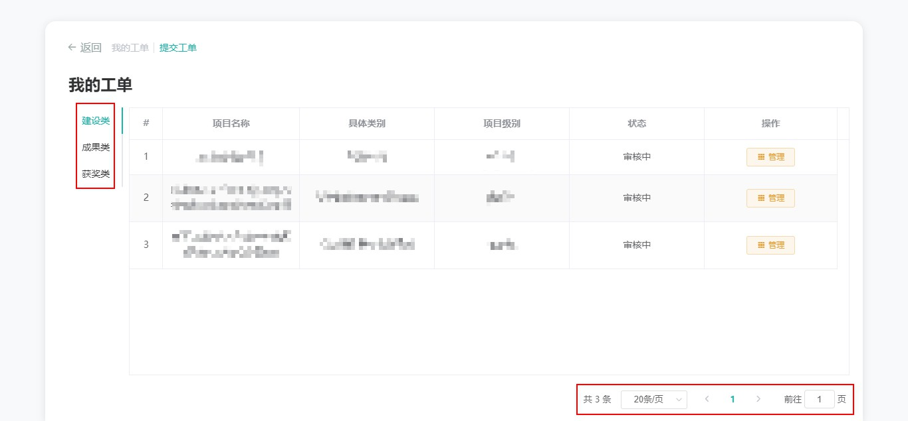
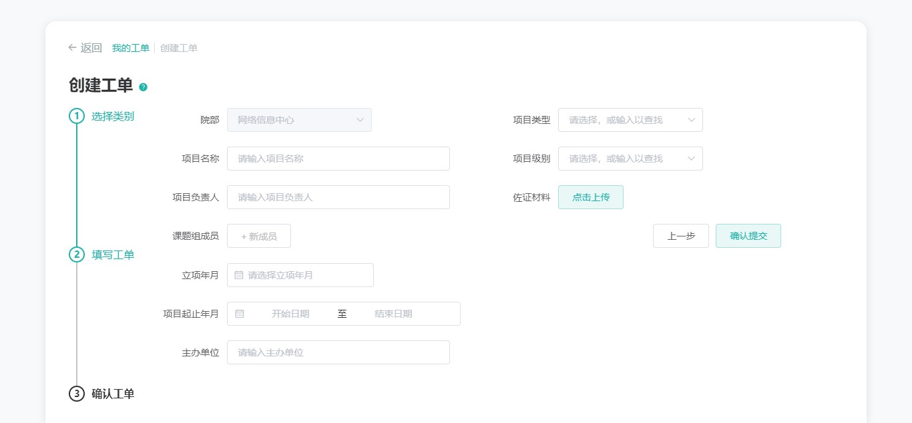
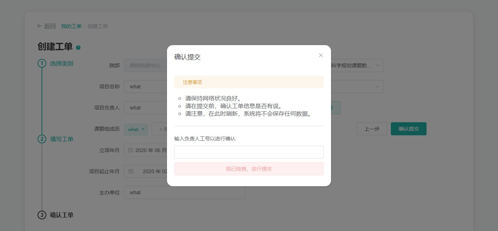
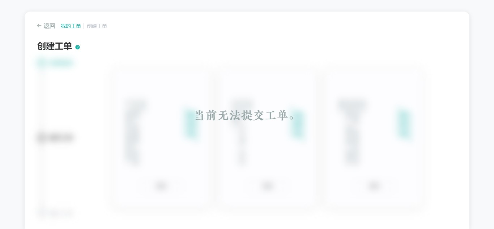

# 用户

!> 请使用最新的 Chrome 浏览器访问 JUST WO 系统，以保证浏览体验。[为什么？](usage/etc?id=使用最新的浏览器访问)

## 前言

JUST WO 系统设计语言简洁，功能指向明确，操作上手难度极低，故以下说明仅列出注意要点。😛

## 登入

在登录时，请依次输入工号、密码。同时，确保登入权限设置为「普通账户」，即选中下方示意图的红色区域。

## 首页

首页的左侧区域为基础信息区，右侧则为功能区。如果不知道某个图标指代的是什么功能，请将鼠标移至其上方，等待大概 300ms 。

## 账户信息

点击「账户信息」卡片，我们将会进入到账户信息功能区域。该区域包含两个功能：「个人资料」和「修改密码」。我们可以通过点击页面左上角的导航栏切换功能，默认选中「个人资料」功能。导航栏示意图如下。

### 个人资料

当前版本下，用户只能查看个人资料，不能自行修改。如果发现信息录入错误，请直接联系管理员。

### 修改密码

修改密码时，需要先输入原密码后，点击验证按钮，才能进行输入新密码的操作。

同时需要注意的是，尽管在设置新的密码时，系统给出了一个非常宽泛的要求 —— 密码位数应大于 6 位，小于 32 位，但我们仍应该 **尽可能地使用复杂密码** 以确保账户的安全。

!> 修改成功后，将会强制重新登录。

## 工单系统

点击「工单系统」卡片，我们进入工单系统区域。该区域同样有两个功能：「我的工单」和「创建工单」，默认选中「我的工单」功能。切换功能操作同「账户信息」。

### 我的工单

「我的工单」示意图如上。

该功能块可供查看我们曾经创建的工单。同时，在「审核中」和「未通过」两种状态下，我们可以点击 `管理` 按钮进行一些编辑操作。

!> 左上侧红色框选区域可点击以切换不同类型的工单，右下角红色框选区则可以进行页面跳转操作。

### 创建工单

创建工单总共分三步，这里依次说明。

!> 当前版本下，在成功提交工单前，所有步骤都不会被系统保存下来，所以请确保操作时网络状况良好。

#### 第一步：选择类别

每一张卡片上都标注了该类别包含的申请类型，你可以查看卡片后，点击 `选定` 按钮进入下一步。~~我们也可以随便点一个，先看看里面到底什么样，再做决定。~~

#### 第二步：填写工单

这里以「建设类」为例。我们从上往下，一个个填写就行，尽可能填写完整。

!> 这里的「项目负责人」是你自己。所有的工单都需要本人填写。

!> 如果你发现该工单并不是你想填写的，请点击 `上一步` 按钮以返回上一步。~~不然，你会后悔的。。。~~

填写完成后，我们点击 `提交工单` 按钮，接下来会弹出下面这样的弹框。

弹框的上半部分写了一些注意事项，下面有一个工号的输入框。这个时候，我们可以选择：要么点击右上角的 `X` 按钮再检查一遍；要么输入自己的工号，点击提交按钮，进行提交。 [为什么需要输入工号以确认？](/)

#### 第三步：确认工单

实际上，我们对工单内容的确认已经在上一步完成了，这一步仅仅是查看页面的返回信息，确保工单被正确的提交。当然，在此之后你也可以切换到「我的工单」，确认工单的状态。

工单成功提交的话，应该有下面这行醒目的大字。😁

#### 其它情况

如果你发现「创建工单」页面是下面这样的，那就说明工单提交页面被 Root 管理员暂时关闭了。假如这是不正确的，请及时联系管理员。

